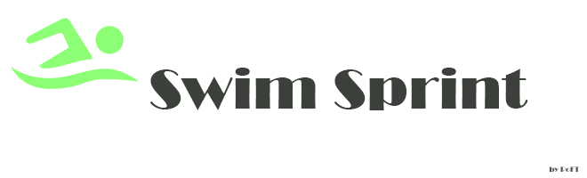

 

***A [Raft] mod that makes you swim faster!***

 
 

[![Button RaftModding]][RaftModding]

 
 

## Features

Use  <kbd>  Sprint  </kbd>  on water to swim faster!

 
 

## Mechanic

*While swimming faster you will use more energy.*

 

| Swim Speed | Oxygen  | Hunger | Thirst
|:----------:|:-------:|:------:|:------:
| `> 1`      | `1.25x` | `1.2x` | `1.2x`
| `> 2`      | `1.5x`  | `1.3x` | `1.3x`

 

<!----------------------------------------------------------------------------->

[RaftModding]: https://www.raftmodding.com/mods/swimsprint
[Raft]: https://raft-game.com/

<!---------------------------------[ Buttons ]--------------------------------->

[Button RaftModding]: https://img.shields.io/badge/RaftModding-3498db?style=for-the-badge&logoColor=white&logo=Wireshark
